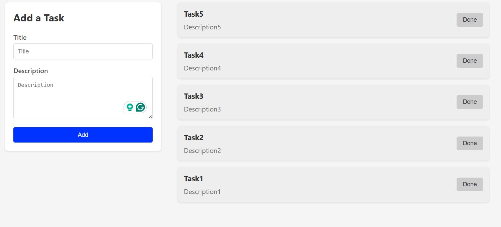

# Todo Task Application

A full-stack todo application built with Spring Boot, React, and MySQL.

## Components

- **Frontend**: React
- **Backend**: Spring Boot REST API
- **Database**: MySQL

## Requirements

- Docker
- Docker Compose

## Running the Application

1. Clone the repository:
   ```bash
      git clone https://github.com/nimeshaviduranga/todo-task-application.git
      cd todo-task-application

2. Start all services using Docker Compose:
   ```bash
      docker-compose up -d

3. Access the application:

   Frontend: http://localhost:3000

   Backend API: http://localhost:8080/api/tasks

   Database: localhost:3306 (accessible with tools like MySQL Workbench)   

4. To stop the application:
   ```bash
      docker-compose down

5. To remove all data volumes as well:
   ```bash
      docker-compose down -v   

## Screenshots

### Main Application UI with added Tasks
